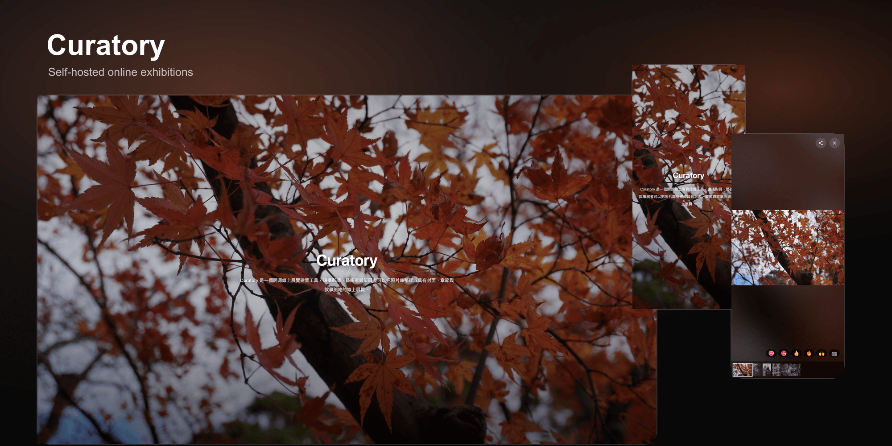

<p align="center">
  
</p>

# <p align="center">Curatory</p>

<p align="center">
  <em>An open-source online exhibition builder for photographers, artists, and curators.</em>
</p>

<p align="center">
  <a href="#quick-start">Quick Start</a> -
  <a href="#features">Features</a> -
  <a href="#documentation">Documentation</a> -
  <a href="#license">License</a>
</p>

---

**Curatory** is an open-source online exhibition builder for photographers, artists, and curators. It helps you turn a photo library into a focused, chapter-based exhibition with a cover, narrative sections, and immersive browsing.

The name combines **curate** and **story** into **Curatory**: a tool for telling stories through curation.

Curatory is not a general-purpose photo gallery switcher. The public site is centered on a single online exhibition: a cover, title, subtitle, description, dates, theme, selected works, reading sections, shareable photo URLs, and Open Graph previews.

## Quick Start

```bash
# 1. Install dependencies
npm install

# 2. Configure environment variables
cp .env.example .env

# 3. Start the development server
npm run dev
```

Open `http://localhost:3000/platform/register` to create the first admin account.

Registration is restricted by `NUXT_AUTH_ALLOWED_EMAILS`. Add the email you want to use before registering.

## Features

- Online exhibition cover with title, subtitle, description, date range, theme, and cover text protection
- Curated sections with media, text position, captions, and image-group layouts
- Desktop horizontal exhibition browsing with mobile-friendly vertical reading
- Lightbox viewing with original image loading, share controls, reactions, and photo permalinks
- Open Graph image generation for the site and individual photo pages
- Focused public header for exhibition viewing
- Admin platform for exhibition settings, photo uploads, sync, and site defaults
- Email/password registration and login with an email allowlist
- Optional Cloudflare Turnstile protection for register and login forms
- S3-compatible storage support for Cloudflare R2, AWS S3, MinIO, and similar providers
- MongoDB persistence
- Browser locale detection with Traditional Chinese and English UI

## Screens

Curatory has two main surfaces:

- **Public exhibition**: the visitor-facing online exhibition experience.
- **Platform admin**: the private management area under `/platform`.

## Requirements

- Node.js 20+
- MongoDB
- S3-compatible object storage
- A public image URL/domain for serving uploaded photos and generated thumbnails

## Documentation

- [Configuration](./docs/configuration.md): environment variables and initial setup.
- [Deployment](./docs/deployment.md): production build, storage CORS, SEO, and operational notes.

## Common Commands

```bash
# Development
npm run dev

# Tests
npm test

# Production build
npm run build

# Preview a production build locally
node .output/server/index.mjs
```

## Project Structure

```text
curatory/
├── app/
│   ├── components/       # Vue components
│   ├── layouts/          # Public and platform layouts
│   ├── locales/          # i18n messages
│   └── pages/            # Nuxt pages
├── server/
│   ├── api/              # Nitro API routes
│   ├── models/           # MongoDB models
│   └── utils/            # Server utilities
├── public/               # Public assets
├── docs/                 # Project documentation
└── tests/                # Vitest tests
```

## Contributing

Contributions are welcome. Please run checks before opening a pull request:

```bash
npm test
npm run build
```

## License

Curatory uses the Attribution Network License (ANL) v1.0 model in this repository:

- Project Code is licensed under AGPL-3.0-or-later with the UI attribution requirement described in `LICENSE`.
- Library Code, where explicitly classified, is licensed under MIT.

See [LICENSE](./LICENSE) for the complete terms.
